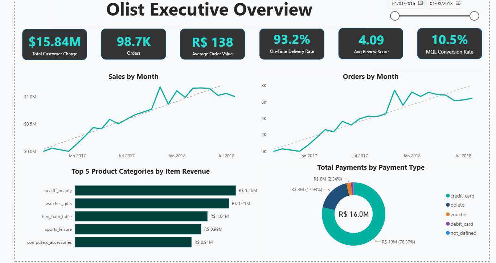
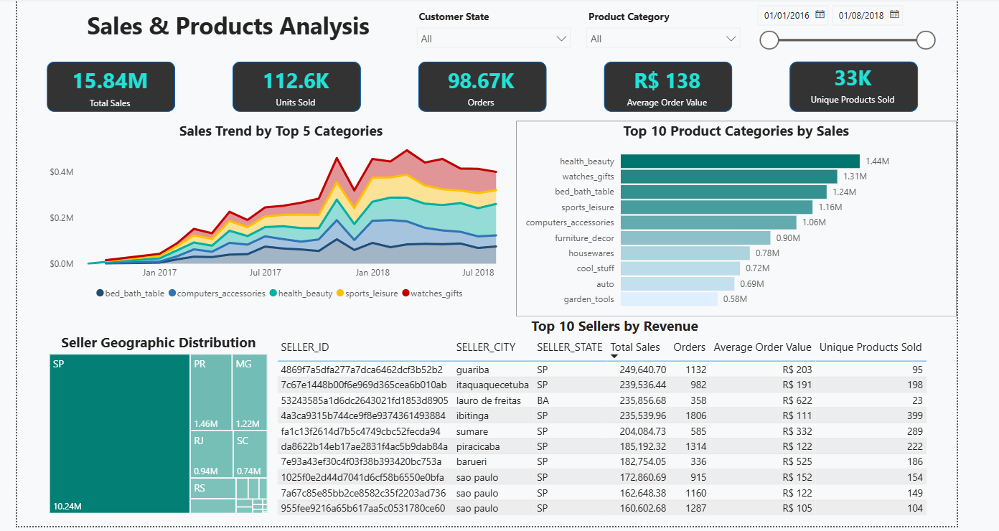
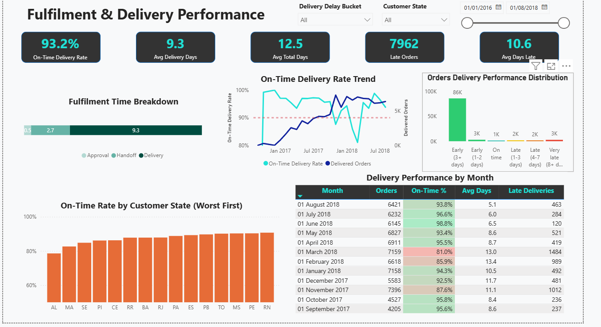
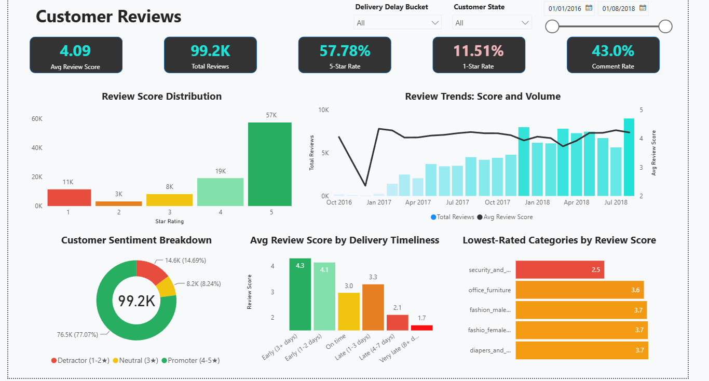
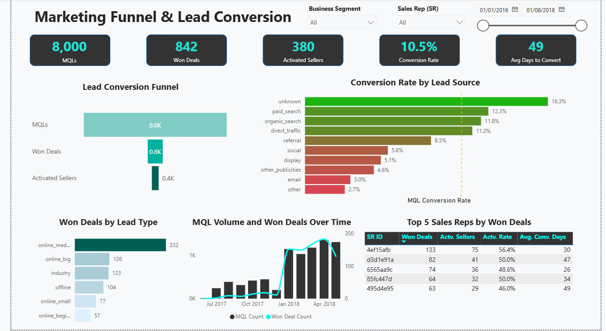
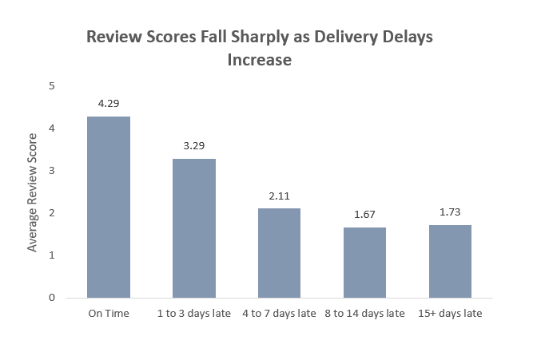
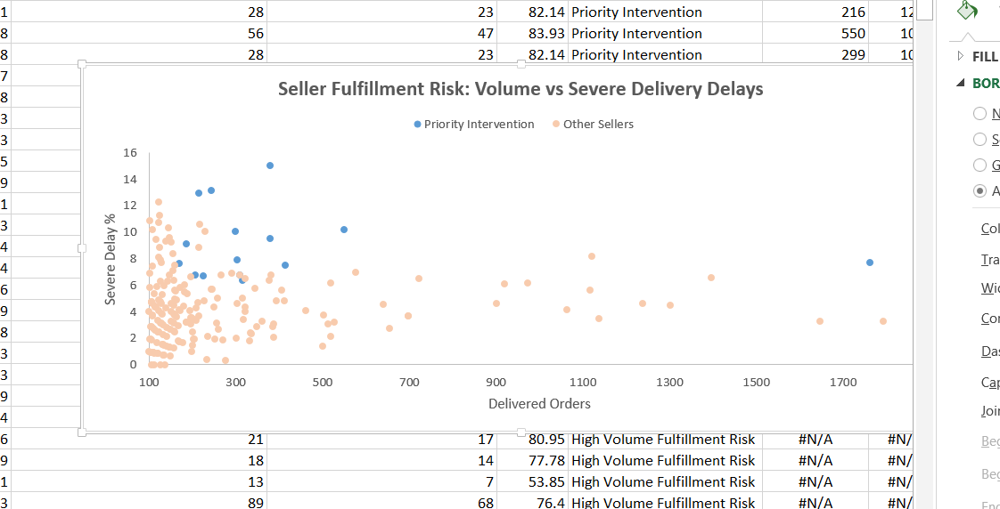
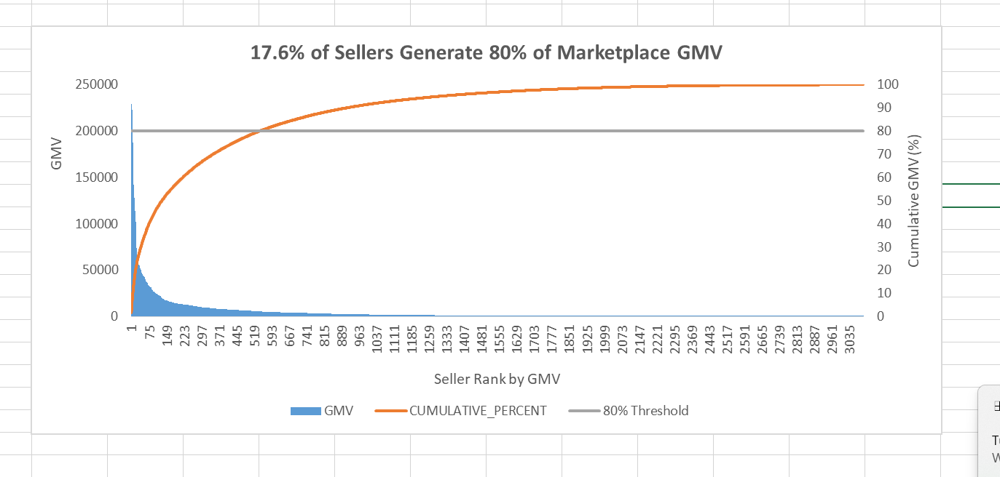
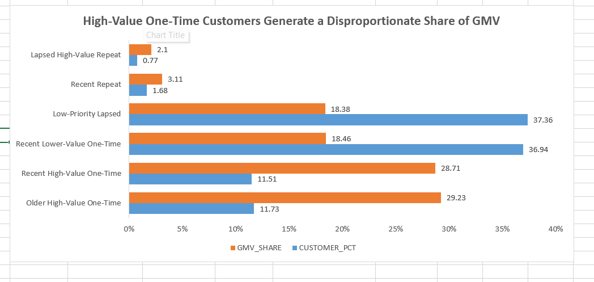
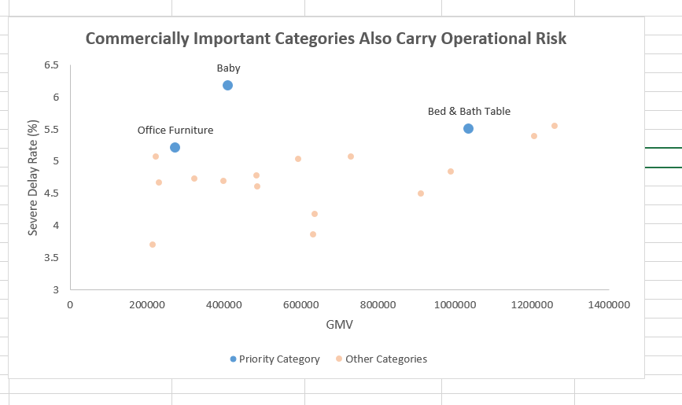

# Olist E-commerce Analytics

An end-to-end analytics project built with Snowflake, dbt and Power BI using real-world e-commerce and marketing datasets from Olist.

I built this project to go beyond a dashboard. The aim was to take the source data through a warehouse and dimensional model, add data quality checks, then use the finished model to answer specific business questions around fulfillment, sellers, customers and product categories.

&nbsp;
<p align="center">
  
</p>

**Power BI Executive Overview:** marketplace sales, orders, average order value, delivery performance, customer reviews and marketing conversion in one reporting view.

## What I built

The project follows a layered dbt structure:

```text
Olist source data (Ecommerce + Marketing)
      |
      v
Snowflake raw tables
      |
      v
Bronze: source-aligned dbt views
      |
      v
Silver: cleaned staging + intermediate models
      |
      v
Gold: dimensional model + analytical models
      |
      +--------------------+
      |                    |
      v                    v
Power BI dashboard     SQL deep dives
```

The Gold layer is modeled as a star schema rather than one large reporting table. This keeps each business process at its natural grain and makes the model easier to test and reuse.

## Tech stack

| Tool | Use |
| --- | --- |
| Snowflake | Cloud data warehouse and SQL engine |
| dbt | Transformations, dimensional modeling, documentation and testing |
| Power BI | Interactive reporting |
| SQL | Business analysis and validation |
| Excel | Static charts for the analytical case study |
| Git / GitHub | Version control and project publishing |

The repository also includes Snowflake semantic view definitions for sales, fulfillment, payments, reviews and the marketing funnel.

## Data

The project uses two public datasets released by Olist:

- [Brazilian E-Commerce Public Dataset by Olist](https://www.kaggle.com/datasets/olistbr/brazilian-ecommerce)
- [Marketing Funnel by Olist](https://www.kaggle.com/datasets/olistbr/marketing-funnel-olist)

The raw CSV files are not committed to this repository.

## Data model

I kept separate fact tables for business processes that operate at different grains.

| Model | Grain | Purpose |
| --- | --- | --- |
| `fact_order_items` | Order item | Product sales, seller sales and GMV analysis |
| `fact_payments` | Order + payment sequence | Payment type, installments and payment value |
| `fact_reviews` | Review + order | Review score and review text |
| `fact_order_fulfillment` | Order | Purchase, approval, carrier handoff, delivery and estimated delivery milestones |
| `fact_marketing_funnel` | Marketing qualified lead | Lead attributes, conversion status and seller acquisition |

The conformed dimensions are:

- `dim_date`
- `dim_customer`
- `dim_product`
- `dim_seller`

A few modeling choices mattered here. I kept fulfillment at order grain instead of joining delivery milestones directly into item-level sales. Reviews also remain at their own grain, and I aggregate them to order level only for analyses that need one customer-experience outcome per order. The date dimension is reused across the different order, review and marketing dates.

## Data quality and testing

I used both dbt schema tests and custom singular tests.

Core keys are checked for uniqueness and nulls, with relationship tests between facts and dimensions. I also added business-rule checks for cases that simple schema tests would miss, including:

- fulfillment dates appearing in a valid sequence
- on-time delivery flags matching the underlying dates
- order item amount and price logic
- payment amounts
- marketing conversion dates
- marketing activation requiring a conversion

The purpose was to make the Gold models safe to analyze rather than treating successful SQL execution as proof that the data was correct.

## Power BI dashboard

I built the Power BI report as the main reporting layer for the project. It provides a broad view of marketplace performance, while the SQL analyses later in this README investigate narrower business questions in more depth.

The report contains dedicated views for sales and products, fulfillment, customer reviews, and the Olist marketing funnel.

**[Open the Power BI file](olist_dashboard.pbix)**

### Sales & Product Performance



This view tracks marketplace sales, order volume, product-category performance, seller geography and the highest-revenue sellers.

### Fulfillment & Delivery Performance



This page monitors delivery reliability, fulfillment-cycle timing, late orders, state-level performance and monthly changes in on-time delivery.

### Customer Reviews



This view brings together review distribution, customer sentiment, review trends, delivery timeliness and the lowest-rated product categories.

### Marketing Funnel & Lead Conversion



This page follows the Olist marketing funnel from MQLs through won deals and activated sellers, with conversion performance by lead source, lead type and sales representative.

## Analytical deep dives

### 1. How much do delivery delays affect customer satisfaction?

**Question:** Does customer satisfaction deteriorate as delivery delays increase?

For this analysis I reduced reviews to one score per order, excluded fulfillment sequence anomalies, and grouped delivered orders by how late they arrived relative to the estimated delivery date.

| Delivery segment | Eligible orders | Avg. review score | Poor review rate |
| --- | ---: | ---: | ---: |
| On time | 89,261 | 4.29 | 9.22% |
| 1 to 3 days late | 1,864 | 3.29 | 32.23% |
| 4 to 7 days late | 1,798 | 2.11 | 67.55% |
| 8 to 14 days late | 1,479 | 1.67 | 80.03% |
| 15+ days late | 1,380 | 1.73 | 78.21% |



The biggest deterioration happens early. Moving from on-time delivery to only 1 to 3 days late takes the poor-review rate from **9.22% to 32.23%**. At 4 to 7 days late it reaches **67.55%**.

I would not describe the relationship as endlessly progressive because the final bucket improves slightly. The average score bottoms out at **1.67** for orders 8 to 14 days late and moves to **1.73** for 15+ days late. The better interpretation is that satisfaction falls sharply as delays increase and appears to bottom out after roughly a week.

**Business implication:** preventing the first few days of lateness matters. Once an order moves several days beyond its promise date, poor reviews become much more common.

[View the analytical model](models/gold/analytics/delivery_delay_impact_on_reviews.sql)

---

### 2. Which sellers should be prioritised for fulfillment intervention?

A high delay rate by itself can be misleading if a seller has very little volume, so I first limited the risk evaluation to sellers with at least **100 delivered orders**.

Within that eligible population I compared:

- delivered order volume
- severe-delay rate, where a severe delay means more than 3 days after the estimated delivery date
- poor-review rate, where the order-level review score is 2 or below

I used the median delivered-order volume and the 75th percentile of severe-delay and poor-review rates as relative thresholds. These are analytical rules for this project, not official Olist definitions.

The segmentation separates sellers into Priority Intervention, High Volume Fulfillment Risk, High Volume Reliable, Watchlist and Lower Priority groups.



**15 sellers met the Priority Intervention criteria.** These sellers combine meaningful volume with unusually high severe-delay and poor-review rates.

The result also showed why volume and rate need to be considered together. The largest Priority Intervention seller had **1,762 delivered orders**, a **7.72% severe-delay rate** and an **18.53% poor-review rate**. Another priority seller had a much higher **15.00% severe-delay rate** across **380 delivered orders**.

The first seller matters because of customer exposure. The second matters because the failure rate itself is extreme.

**Business implication:** seller intervention should be based on both operational failure rates and the number of customers exposed to those failures. I would review Priority Intervention sellers first and keep Watchlist sellers under observation as their volume grows.

[View the analytical model](models/gold/analytics/seller_fulfillment_risk.sql)

---

### 3. How concentrated is seller GMV, and how much of it comes from risky sellers?

The seller-risk analysis tells us who is struggling operationally. The next question is whether those sellers are commercially important.

I calculated GMV at seller level using product sales value excluding freight, ranked all sellers from highest to lowest GMV, and calculated cumulative GMV.



There are **3,095 sellers** in the analysis. It takes only **544 sellers**, or **17.58%**, to reach roughly **80% of marketplace GMV**.

I then joined that commercially important seller cohort back to the fulfillment-risk segmentation. I treated sellers classified as either Priority Intervention or High Volume Fulfillment Risk as the elevated-risk group.

The result:

| Metric | Result |
| --- | ---: |
| Sellers required to reach ~80% GMV | 544 |
| Share of all sellers | 17.58% |
| Elevated-risk sellers within that cohort | 30 |
| GMV generated by those 30 sellers | 1,851,557.98 |
| Share of total marketplace GMV | 13.62% |
| Share of Pareto-cohort GMV | 17.02% |

The important wording here is that **13.62% of marketplace GMV is generated by sellers meeting the elevated-risk criteria**. It is not a prediction that 13.62% of GMV will be lost.

**Business implication:** a small set of operationally weak sellers has meaningful commercial weight. These sellers deserve more attention than the seller count alone would suggest because problems in this group affect a sizeable share of marketplace activity.

[View the analytical model](models/gold/analytics/seller_gmv_concentration.sql)

---

### 4. Where is the strongest customer retention opportunity?

Traditional RFM segmentation is not very useful when almost everyone has the same purchase frequency. In this dataset, **96.95% of customers placed only one order**, so forcing customers into frequency quintiles would create artificial distinctions.

I kept recency and monetary scoring, but replaced frequency scoring with behavioral groups:

- one-time customer
- repeat customer
- frequent customer

This produced six customer segments.

| Customer segment | Customers | Customer share | Segment GMV | GMV share |
| --- | ---: | ---: | ---: | ---: |
| Older High-Value One-Time | 11,190 | 11.73% | 3,973,122.33 | 29.23% |
| Recent High-Value One-Time | 10,986 | 11.51% | 3,902,197.95 | 28.71% |
| Recent Lower-Value One-Time | 35,249 | 36.94% | 2,509,331.49 | 18.46% |
| Low-Priority Lapsed | 35,653 | 37.36% | 2,498,592.14 | 18.38% |
| Recent Repeat | 1,603 | 1.68% | 422,689.86 | 3.11% |
| Lapsed High-Value Repeat | 739 | 0.77% | 285,709.93 | 2.10% |



The two high-value one-time segments are the main result. Together they represent **23.24% of customers but 57.94% of marketplace GMV**.

I also looked at the timing of the second purchase. **2,913 customers** placed at least two distinct orders, but **875 second orders (30.04%)** happened on the same calendar date. Those may be split transactions rather than genuine retention behavior, so I separated them from later returns.

That leaves **2,038 customers (69.96% of repeat customers)** who came back on a later date.

Among those later-returning customers:

| Return timing | Days to second purchase |
| --- | ---: |
| 25th percentile | 23 |
| Median | 74.5 |
| 75th percentile | 177 |
| 90th percentile | 291.3 |

**Business implication:** the clearest retention opportunity is to convert Recent High-Value One-Time customers into second-time buyers. A second-purchase campaign in the first 2 to 3 months after purchase is consistent with the observed return pattern. Older High-Value One-Time customers are better treated as a separate win-back audience.

[View the analytical model](models/gold/analytics/customer_adapted_rfm_segmentation.sql)

---

### 5. Which important product categories also show operational or customer-experience risk?

The final analysis looks at what is being sold rather than who is selling or buying it.

I ranked categories by GMV and found that **18 of 72 categories**, or **25%**, are needed to cross the 80% GMV threshold. The 18th category takes cumulative GMV to **81.20%**.

For those commercially important categories I added:

- order volume
- average review score
- poor-review rate
- late-delivery rate
- severe-delay rate

I then calculated the 75th percentile of poor-review rate and severe-delay rate within the Pareto category cohort.

A category is:

- **Priority Category** when both rates are at or above their respective 75th-percentile thresholds
- **Customer Experience Risk** when only poor-review rate is elevated
- **Fulfillment Risk** when only severe-delay rate is elevated
- **Relatively Healthy** otherwise



The flagged categories are:

| Category | GMV rank | GMV | Avg. review | Poor review rate | Severe delay rate | Segment |
| --- | ---: | ---: | ---: | ---: | ---: | --- |
| health_beauty | 1 | 1,258,681.34 | 4.18 | 12.66% | 5.56% | Fulfillment Risk |
| watches_gifts | 2 | 1,205,005.68 | 4.07 | 15.19% | 5.40% | Fulfillment Risk |
| bed_bath_table | 3 | 1,036,988.68 | 3.97 | 16.63% | 5.50% | Priority Category |
| computers_accessories | 5 | 911,954.32 | 4.03 | 16.00% | 4.50% | Customer Experience Risk |
| furniture_decor | 6 | 729,762.49 | 4.01 | 16.63% | 5.08% | Customer Experience Risk |
| baby | 12 | 411,764.89 | 4.04 | 16.01% | 6.17% | Priority Category |
| office_furniture | 15 | 273,960.70 | 3.62 | 22.64% | 5.21% | Priority Category |

`bed_bath_table` stands out because it combines **#3 GMV rank** with elevated poor reviews and severe delays. `baby` has the highest severe-delay rate in the Pareto group at **6.17%**, while `office_furniture` has the weakest customer-experience result with a **3.62 average review score** and a **22.64% poor-review rate**.

The two highest-GMV categories, `health_beauty` and `watches_gifts`, are both Fulfillment Risk categories, while `computers_accessories` and `furniture_decor` are flagged on customer experience.

There is an attribution limitation in this analysis. Reviews and fulfillment outcomes are measured at order level, and one order can contain products from multiple categories. I therefore interpret these results as **orders containing products from these categories have elevated review or delivery-risk rates**, not that the category itself caused the outcome.

**Business implication:** start with the Priority Categories, especially `bed_bath_table` because of its commercial scale. Fulfillment monitoring should also focus on `health_beauty` and `watches_gifts`, while the customer-experience issues in `computers_accessories` and `furniture_decor` need separate investigation.

[View the analytical model](models/gold/analytics/product_category_performance_and_concentration.sql)

---

### 6. Do customers show meaningful cross-category purchase affinity?

To understand whether customers tend to buy products from different categories together, I analysed unique category combinations within each order and calculated support, directional confidence, and lift. Categories labelled as `Unknown` were excluded, and only pairs appearing together in at least 5 orders were retained to reduce noise from one-off combinations.

Only **786 of 98,666 orders (0.8%)** contained products from more than one category, indicating that cross-category purchasing was uncommon.

Among **36 recurring category pairs**, only one showed positive affinity:

| Category A                | Category B        | Orders Together | Confidence A → B | Confidence B → A | Lift |
| ------------------------- | ----------------- | --------------: | ---------------: | ---------------: | ---: |
| Bed, Bath & Table         | Home Comfort      |              43 |            0.46% |           10.83% | 1.12 |
| Construction Tools Lights | Furniture & Decor |              11 |            4.51% |            0.17% | 0.68 |
| Furniture & Decor         | Home Construction |              13 |            0.20% |            2.65% | 0.40 |

The most frequently purchased category pair was **Bed, Bath & Table + Furniture & Decor**, appearing together in 70 orders. However, its lift was only **0.11**, showing that high co-occurrence was largely driven by the popularity of the individual categories rather than genuine affinity.

The strongest relationship was **Home Comfort → Bed, Bath & Table**. Around **10.83% of Home Comfort orders** also contained Bed, Bath & Table products, with a lift of **1.12**.

**Business implication:** The data provides little evidence to support broad cross-category bundling or recommendation strategies. A targeted Home Comfort to Bed, Bath & Table cross-sell could be tested, but merchandising efforts are likely to have greater impact by improving product discovery and complementary recommendations within individual categories.

[View the analytical query](analyses/product/product_category_affinity.sql)


## Recommendations

Taken together, the analyses point to a list of actions to improve the overall business health:

1. **Reduce avoidable delivery lateness early.** Poor-review rates rise from 9.22% for on-time orders to 32.23% at only 1 to 3 days late.
2. **Review the 15 Priority Intervention sellers first.** They combine established volume with elevated severe delays and poor reviews.
3. **Protect commercially important sellers.** Thirty elevated-risk sellers inside the Pareto cohort generate 13.62% of total marketplace GMV.
4. **Focus retention on high-value one-time buyers.** They represent 23.24% of customers but 57.94% of GMV.
5. **Investigate Priority Categories at category level.** `bed_bath_table`, `baby` and `office_furniture` combine commercial importance with weak operational and/or customer-experience outcomes.

## Repository structure

```text
olist-ecommerce-analytics/
|
|-- analyses/
|   |-- customer/
|   |-- fulfillment/
|   `-- product/
|
|-- assets/
|   |-- executive.png
|   |-- customer_reviews.png
|   |-- fulfillment.png
|   |-- marketing.png
|   |-- sales.png
|   |-- 01-delivery-delay-review-scores.png
|   |-- 02-seller-fulfillment-risk.png
|   |-- 03-seller-gmv-concentration.png
|   |-- 04-customer-segment-gmv-share.png
|   `-- 05-category-operational-risk.png
|
|-- models/
|   |-- bronze/
|   |-- silver/
|   |   |-- staging/
|   |   `-- intermediate/
|   |-- gold/
|   |   |-- dimensions/
|   |   |-- facts/
|   |   `-- analytics/
|   `-- semantic/
|
|-- tests/
|-- macros/
|-- seeds/
|-- snapshots/
|-- dbt_project.yml
|-- packages.yml
`-- olist_dashboard.pbix
```

# Running the dbt project

The raw Olist data needs to be loaded into Snowflake first. Source definitions are in `models/bronze/sources.yml`.

Create a local dbt profile named `olist_analytics` for your own Snowflake environment. Credentials are intentionally not stored in this repository.

Then install the project dependencies:

```bash
dbt deps
```

Check the connection:

```bash
dbt debug
```

Build the models and run tests:

```bash
dbt build
```

The project uses `dbt_utils` and the Snowflake semantic view package.

# Notes and limitations

- GMV in the seller and category deep dives is product sales value excluding freight.
- The seller and category risk thresholds are analytical segmentation rules created for this project, not official Olist business definitions.
- Same-day second orders are kept separate from later-day returns because they may represent split transactions rather than genuine repeat behavior.
- Category-level review and fulfillment analysis uses order-level outcomes, so it shows association rather than category-level causation.

## Project Files

- [Power BI dashboard](olist_dashboard.pbix)
- [Gold dimensional models](models/gold/)
- [Analytical models](models/gold/analytics/)
- [Business analysis queries](analyses/)
- [Custom tests](tests/)
